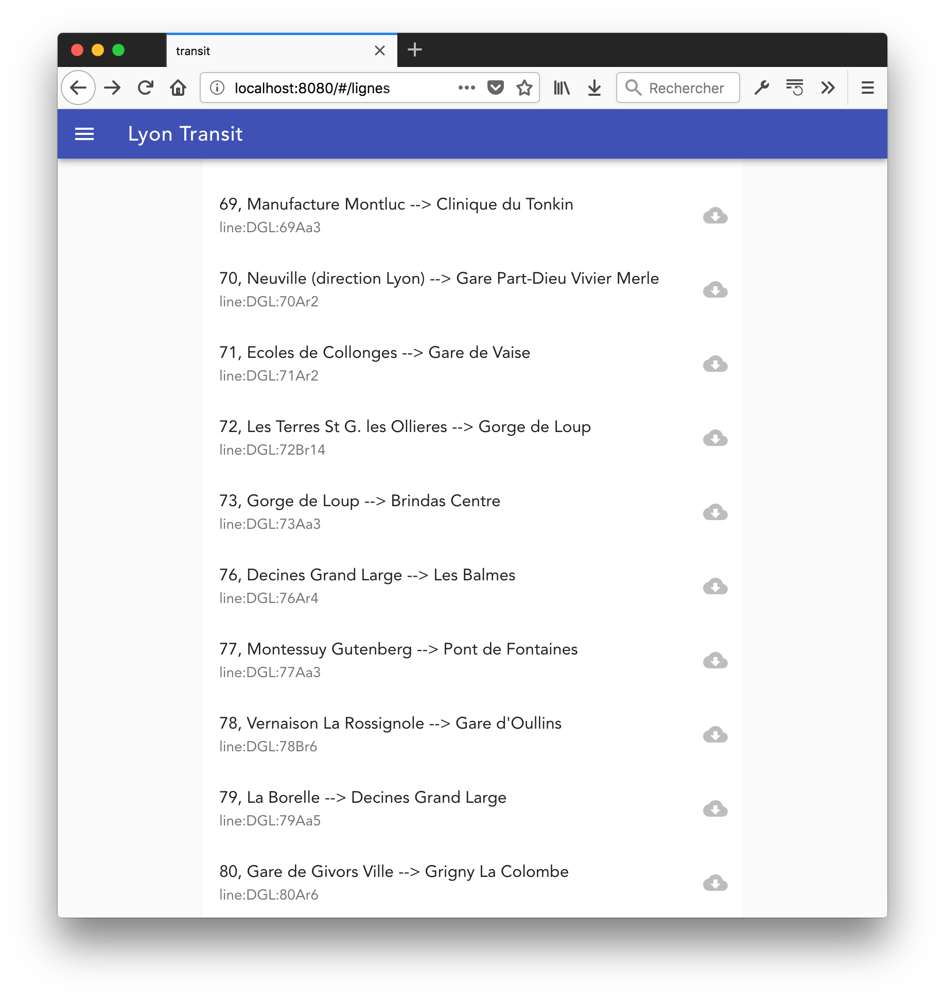

## TP 6 : Stockage local

Nous allons continuer le TP précédent et mettre en cache, c'est à dire stocker localement dans le navigateur, des données pour éviter leur rechargement. 

### Utilisation de l’API de Navitia

Voir la [première partie du TP précédent](../TP5/).

### Requêtage des horaires des lignes de métro/bus.

Nous allons implémenter plusieurs requêtes vers l'API de navitia et créer des composants associés. 

##### Récupération des lignes de TCL

Une requête GET sur le end-point suivant de l'API permet de récupérer la liste des lignes TCL : `https://api.navitia.io/v1/coverage/fr-se/networks/network:tcl/lines?` Attention, les résultats sont paginés, il y a 154 lignes opérées par TCL.

Le paramètre `start_page` permet de demander la page souhaitée.

Suivez ce [lien](http://canaltp.github.io/navitia-playground/play.html?request=https%3A%2F%2Fapi.navitia.io%2Fv1%2Fcoverage%2Ffr-se%2Fnetworks%2Fnetwork%253Atcl%2Flines%3F) pour tester l'API dans le bac à sable de Navitia.

Explorez l'objet JSON retourné, notamment la liste de ligne. Pour chaque ligne on s'intéressera aux clés `code`,  `name`, et `id`.

##### Affichage de la liste des lignes

Créer un composant `Lignes` (et ses enfants) qui affiche la liste de lignes. Utiliser Vuetify pour cela. Suivez le même principe que l'affichage des résultats du TP précédent.

Vous pouvez ajouter à la `v-list` vuetify un boutton `v-list-tile-action` (voir la [doc](https://vuetifyjs.com/en/components/lists#example-icon-two-lines-and-action))

##### Récupération des informations d'une ligne TCL

En cas de clic sur le bouton télécharger nous allons maintenant récupérer les horaires de la ligne, grace à son identifiant. La requête GET devrait avoir la forme suivante :

`https://api.navitia.io/v1/coverage/fr-se/lines/line:DGL:C9Aa9/route_schedules?from_datetime=20180722T120000&items_per_schedule=25`

Il semblerait qu'il soit nécessaire d'indiquer une date/heure et un nombre d'éléments à renvoyer. Prenez soit la date/heure actuelle, soit une suffisamment dans le futur (juillet).

##### Sauvegarde des horaires d'une ligne 

