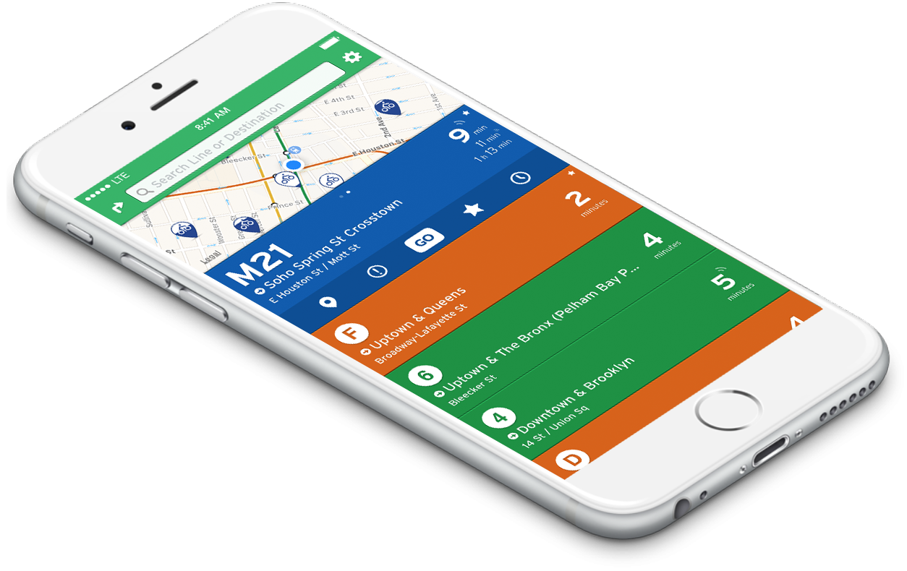

<!-- $theme: gaia -->
<!-- page_number: true -->

# Programmation Web Avancée et Mobile

### Introduction

Aurélien Tabard - Lionel Médini

---

## Programmation Web Avancée et Mobile

Suite de M1IF03 - Programmation Web

Objectif: maitriser les technos Web modernes

- UE "tout JavaScript"
- Stack d'outils de programmation pour JS
- Web mobile et applications offlines

---
## Contenu de l'UE

- Outils de programmation en JS
- Frameworks JS
- Programmation asynchrone
- Programmation réactive
- APIs HTML5
- Web mobile

---

## Outils de programmation en JS

- Node & NPM
- Vue.js
- Stack d'outils de gestion de projet
- IDE Webstorm ou éditeur de code avancé

---

## APIs HTML5
- Mécanismes de stockage : LocalStorage, IndexedDB
- Web components
- Web messaging
- WebSockets
- Web workers
- Cross-domain requests

---
## Web mobile

- Mobile first
- Responsive design
- Touch events
- Device API
- API de géolocalisation
- Offline apps

---

## Organisation de l'UE

- 10 séances de 3h (les créneaux sont plus grands)
- CM : 30->60 minutes
- Exposés : 30 minutes
- TP : 60->90 minutes

---

## Exposés

- En fin de cours
- Groupes de 3 ou 4
- 12 minutes de présentation avec démo/réalisation
- 5-10 minutes de questions

[Liste des exposés](https://aurelient.github.io/mif13/2018/exposes)

Date limite de choix des sujets : 1er février 2018

Pull request sur la page github des sujets.

---

## TP

Projet filé tout au long du semestre.

Conception d'une application de transport

Utilisation de Vue.js et d'API dédiées.

---
## Procédure de correction des TP

  - Vous pushez votre code dans la forge
  - Vous ajoutez vos encadrants comme reporters du projet
  - Vous remplissez un questionnaire pour indiquer vos coordonnées et l'id du projet
  - Nous exportons vos réponses au questionnaire
  - Nous lançons une moulinette pour cloner et déployer l'ensemble des projets
  - Nous uploadons les réponses au questionnaire dans cette moulinette
  - Elle génère un fichier de notes pour tous les étudiants présents dans le questionnaire
  - Nous corrigeons le TP et mettons les notes
  - Nous importons ces notes dans Tomuss

---

## TP : Problèmes constatés (1/2)

- Impossible de cloner le projet
  - Erreur dans l'identifiant du projet
  - Nous n'avons pas les droits d'accès au projet
- Manque de doc
  -  Placez tous les fichiers dans le repo du projet
  -  README.md obligatoire et clair sur les étapes à suivre pour faire tourner votre code

---

## TP : Problèmes constatés (2/2)

Notre contexte de déploiement (IP, port, chemin) est différent de celui de votre machine.
  - URLs absolues dans le code
  - Ne mettez pas le contexte en dur dans votre code
  - Déployez votre projet sur une autre machine, et testez toutes les fonctionnalités.
  - "Ça marche chez moi" n'est pas une bonne excuse.
  - Testez sur plusieurs navigateurs (en particulier pour le mobile)

---

# Modalités d'Évaluation

- UE en contrôle continu
- 1 CC individuel en fin de semestre
  - Pas de deuxième session
- Évaluation des TP
  - 1e TP d'échauffement
  - 3 rendus
  - TP Rendus sur la forge
  - Les rendus de TP identiques seront notés 0 pour TOUS les groupes incriminés

---

## A l'extérieur de l'université
- [LyonTechHub](http://www.lyontechhub.org/#!/)
- [Lyon JS](https://www.meetup.com/LyonJS/)
  - Pour améliorer vos connaissances
  - Pour étendre votre réseau
- [Vue.js Lyon](https://www.meetup.com/Vue-js-Lyon/) Meetup le 1e février
